<div align="center">

<!-- Custom Cybernetic Terminal Banner -->


<br>

<!-- Typing animation with Fira Code font and Neon Green color -->


<br>

<!-- Custom Styled Badges matching the Cyber theme -->


</div>


## 👾 System Status: About Me


```yaml
# SYSTEM INFORMATION PROTOCOL
[USER_IDENTITY]
  Name        : Vishal Joshi
  Class       : BCA Student & Tech Explorer
  Core_Intent : AI-Powered Application Engineering
  Philosophy  : "Consistency beats motivation."

[SPECIFICATIONS]
  CPU         : Brain (Logical Analysis, Core Problem Solving)
  Interests   : Chess ♟ | Logic Puzzles 🧩 | Tech Exploration 🤖
  Drives      : Building smart, automated, real-world systems
  Status      : Actively parsing Java & DSA subroutines
```

<br clear="right">


## 🚀 Core Subroutines & Focus

<table border="0">
<tr>
<td width="50%" valign="top">

### 🟢 Currently Learning

- ☕ **Java & OOP** (Advanced concepts)
- 📚 **Data Structures & Algorithms** (Solving daily)
- 🐍 **Python Ecosystem** (For automation & scripting)
- 📱 **Flutter & Dart** (Cross-platform architectures)
- 🤖 **Generative AI** (LLMs & prompt engineering)
- ☁ **Cloud Computing** (AWS fundamentals)

</td>
<td width="50%" valign="top">

### 🎯 Key Directives

- `[✓]` Master core Java syntax & structures
- `[✓]` Build robust algorithmic skills in DSA
- `[✓]` Design smart AI-powered mobile apps
- `[✓]` Learn modern backend and server architectures
- `[✓]` Maintain a daily coding contribution streak
- `[✓]` Solve complex logical puzzles

</td>
</tr>
</table>


## 🧠 Areas of Interest

```text
  🧠 Cognitive Systems ────────────────► Artificial Intelligence & Generative AI
  📱 Interface Layer   ────────────────► Cross-Platform Mobile Applications
  🏗 Architecture      ────────────────► System Design & Microservices
  ☁ Cloud Node         ────────────────► AWS & Distributed Computing
  🗄 Storage Nodes     ────────────────► Database Management Systems (SQL & NoSQL)
  🔐 Security Protocols────────────────► Cyber Security & Sockets
```


## 💻 Tech Stack & Modules

### 👾 Programming Core
<p>
  
</p>

### 📱 Mobile Frameworks & Ecosystem
<p>
  
</p>

### 🌐 Web & Server Interface
<p>
  
</p>

### 🛠 Tooling & Workspace Env
<p>
  
</p>

### 🗄 Databases & Cloud Infrastructure
<p>
  
</p>


## 🚀 Featured Projects

<table>
<tr>

<td width="50%" valign="top" style="border: 1px solid #121c33; border-radius: 8px; padding: 12px; background: #050814;">

### 🏙️ Smart City App
*AI-Powered Smart City Management Application*

- **Complaint Management:** Direct grievance reporting system.
- **Emergency SOS:** Instant emergency triggers.
- **AI Chatbot:** Automated support and queries.
- **Disaster Reporting:** Real-time localized alerts.
- **Tech Stack:** `Flutter` • `Java` • `MongoDB` • `Firebase` • `REST API`

</td>

<td width="50%" valign="top" style="border: 1px solid #121c33; border-radius: 8px; padding: 12px; background: #050814;">

### 🌐 Personal Portfolio
*Modern Responsive Cyber-Themed Portfolio*

- **Responsive Design:** Seamless across mobile/desktop viewports.
- **Neon Dark Theme:** Futuristic dark aesthetics.
- **Interactivity:** Smooth navigation transitions & scroll animations.
- **Tech Stack:** `HTML` • `CSS` • `JavaScript`

</td>

</tr>
</table>


## 📈 System Metrics (GitHub Analytics)

<div align="center">

<!-- GitHub Stats with Custom Cyber Colors matching the theme -->


<br><br>

<!-- Streak Stats with Custom Cyber Colors matching the theme -->


<br><br>

<!-- Github Trophies in transparent Matrix theme -->


<br><br>

<!-- Contribution Activity Graph styled in Matrix/Green -->


</div>

<br>

<div align="center">

### ⚡ Profile Summary Cards


<br>


</div>


## 📖 Learning Timeline & Goals

```text
2024  ██████████████████░░░░ Initiated programming journey (C, Web Basics)
2025  ███████████████████████ Expanded logical skills with C/C++ & OOP
2026  █████████████████████████ Mastering Java Core & Data Structures & Algorithms
2026  █████████████████████ Scaling App Development skills with Flutter & Dart
2026  ████████████████████ Exploring Generative AI, Prompt Eng, LLM API integration
Next  ➜ System Design (High Level / Low Level), Cloud Nodes, Backend Architectures
```

### 🎯 2026 Milestones
- 🚀 Master Object-Oriented Java Programming
- 📚 Solidify DSA problems and competitive programming capabilities
- 🤖 Build and deploy AI-powered mobile features
- 💼 Contribute actively to open-source systems
- ⭐ Reach 1000+ GitHub contributions with a solid green activity matrix


## ⚙️ Core Philosophy & Routines

```cpp
// INFINITE EVOLUTION LOOP
while (alive) {
    Learn();
    Build();
    Improve();
    Repeat();
}
```

```text
"First, solve the problem. Then, write the code." — John Johnson
```


## 🐍 Contribution Snake

> *Will update active trail path automatically after GitHub Action configuration completes.*

<p align="center">
  
</p>


## 🌐 Network Interconnect: Connect with Me

<div align="center">

<a href="https://www.linkedin.com/in/vishal-joshi-041719375">
  
</a>
&nbsp;
<a href="https://github.com/vishalJoshiVJ00">
  
</a>
&nbsp;
<a href="mailto:YOUR_EMAIL@gmail.com">
  
</a>

</div>

<br>

<div align="center">
  
</div>
